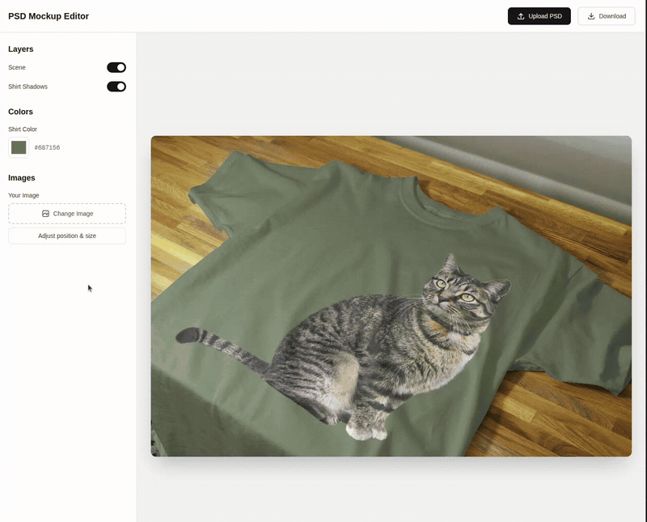

# PSD Mockup Editor

> A real-time, browser-based mockup editor that turns a designer's layered `.psd` into a live, editable template — recolor layers, swap in images with correct perspective, and export the result. **100% client-side, no backend.**

**🔗 [Live demo](https://nextjs-psd-canvas-engine.vercel.app/)** &nbsp;·&nbsp; [Business Card](https://nextjs-psd-canvas-engine.vercel.app/examples/business-card) &nbsp;·&nbsp; [Book Cover](https://nextjs-psd-canvas-engine.vercel.app/examples/book-cover) &nbsp;·&nbsp; [T-Shirt](https://nextjs-psd-canvas-engine.vercel.app/examples/t-shirt)



---

## Why I built this

This project exists to back up a claim. I previously built the mockup editor — the hardest part of a large product called **cr8** — for my employer. That code is private and company-owned, so I couldn't share it directly. Instead, I rebuilt the core of that editor **from scratch** as a standalone, open app, so anyone could *see it running live* rather than take my word for it.

Every line of parsing, the non-destructive rendering pipeline, and the perspective-correct image placement in this repo was written by me. It's a portfolio piece that demonstrates the engineering behind that work — without touching the original code.

---

## What it does

Upload a `.psd` whose layers are *tagged by name*, and those layers become live-editable while the rest of the mockup stays untouched:

- **🎨 Recolor** any tagged layer through a color picker.
- **🖼️ Swap images** into tagged slots — the replacement is placed at the smart object's original **perspective and angle**, fills the area (cover), and is cropped to its bounds so it looks like it belongs in the mockup.
- **✋ Reposition & resize** placed images in a dedicated dialog (drag to pan, slider to zoom).
- **👁️ Show / hide** individual layers.
- **⬇️ Export** the finished mockup as a PNG.
- **📦 Built-in examples** — try it without your own PSD.
- **📱 Responsive** — controls collapse into a slide-in drawer on mobile.
- **⚡ Live, non-destructive** re-rendering on every edit.

---

## The hard parts

A few problems in here are more interesting than they look. These are the bits I'm proudest of:

**1. Perspective-correct image placement.** A mockup's image slot (a Photoshop smart object) is rarely axis-aligned — it's tilted in 3D space. The editor reads the slot's recorded perspective quad and maps the uploaded image into it using a **homography**. The Canvas 2D API has no native perspective transform, so the quad is rebuilt from an N×N grid of small affine-transformed cells. The subtle part: you must subdivide the *source* rectangle, not the projected image — that's what keeps the fill cropped exactly to the quad with zero overflow.

**2. Non-destructive, idempotent rendering.** Every editable layer's pixels are snapshotted **once** at parse time, and that pristine snapshot is the source of truth. On every edit, the renderer rebuilds each editable layer's canvas from the snapshot + the current value, then composites everything onto the main canvas. Because the original pixels are never overwritten, the same render runs safely under React StrictMode's double-invoked effects and can't lose data.

**3. Clipping masks.** The renderer composites layers in order and correctly honors Photoshop-style clipping masks — a clipped layer only paints where it overlaps the previous non-clipped layer, and consecutive clipped layers all mask against the same base.

**4. Zero-backend, untainted export.** Everything runs in the browser: the PSD is parsed from an `ArrayBuffer`, user images come from blob URLs, and the canvas never holds cross-origin pixels — so PNG export via `canvas.toBlob` always succeeds.

---

## What I learned

This was the first project I ever started **without any idea how to build it** — no tutorial, no reference path, just a blank slate and a `.psd` file. The single biggest lesson it taught me was a habit I now lean on for everything: **never conclude "I can't do this" until I've actually searched for the solution.**

Almost every hard part above — perspective rendering with a homography, non-destructive re-rendering that survives StrictMode, reading a smart object's placement — started as something that *looked* impossible, and turned out to have a known technique once I went looking. Mapping a perspective quad with grid-subdivided affine cells is a good example: Canvas 2D "can't do perspective"… until you decompose it into pieces that it *can* do.

The takeaway I'd repeat to anyone: the gap between *impossible* and *already-solved* is usually one good search away.

---

## Tech stack

Next.js 16 (App Router) · React 19 · TypeScript · Tailwind v4 · Biome · React Compiler · [ag-psd](https://www.npmjs.com/package/ag-psd)

---

## Getting started

**Prerequisites:** [pnpm](https://pnpm.io) and Node.js.

```bash
pnpm install
pnpm dev      # → http://localhost:3000
```

Open the app, upload a `.psd`, or pick a built-in example from the empty state.

| Script | What it does |
| --- | --- |
| `pnpm dev` | Start the dev server |
| `pnpm build` / `pnpm start` | Production build / serve |
| `pnpm lint` | `biome check` |
| `pnpm format` | `biome format --write` |

---

## Designing a PSD for this editor

A layer-naming convention links a PSD to the editor. Top-level layers whose names start with one of these prefixes become editable:

| Prefix | Editable type |
| --- | --- |
| `mm_clr:` | Recolorable layer (solid shape / masked fill) |
| `mm_wrp:` | Image-replacement slot |
| `mm_img:` | Image-replacement slot |

Notes for designers:

- `mm_wrp:` and `mm_img:` are treated identically today (the wrap/fit distinction is reserved).
- Image slots should be **smart objects** so the editor can read their perspective/placement and apply it to the replacement.
- Editable layers **must be top-level children** of the document, not nested in groups.

---

## Architecture

| Area | Files |
| --- | --- |
| Layer-name contract & extraction | [`src/utils/mockupLayers.ts`](./src/utils/mockupLayers.ts) |
| Non-destructive render pipeline + perspective placement | [`src/utils/renderer.ts`](./src/utils/renderer.ts) |
| Editor state & canvas ownership | [`src/components/Editor.tsx`](./src/components/Editor.tsx) |
| Per-editable-type controls (color / image / transform / toggle) | [`src/components/controls/`](./src/components/controls/) |
| Built-in example registry | [`src/data/examples.ts`](./src/data/examples.ts) |

The full architecture and the subtle invariants that are easy to break are documented in [`CLAUDE.md`](./CLAUDE.md).

---

## Author

**Khaled Refaat** — [Portfolio](https://www.khaledelkady.com/) · [GitHub](https://github.com/khaledrefaat)

## License

[MIT](./LICENSE) — free to use, fork, and learn from.
